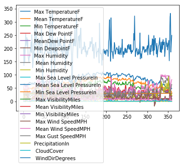
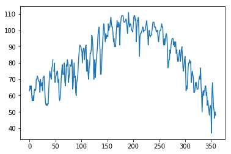
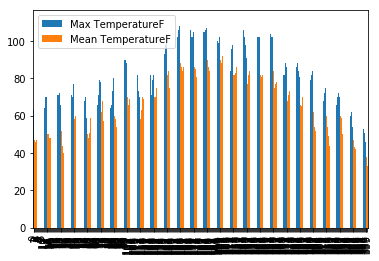
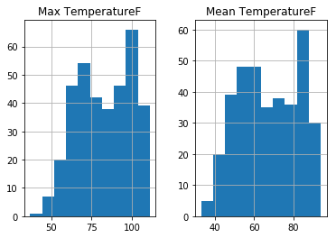
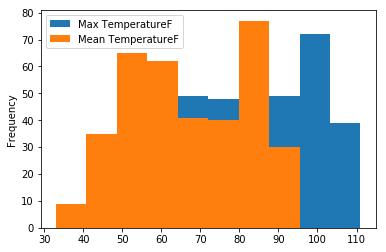
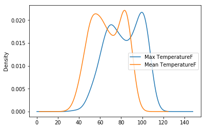

# pandas 库
- [官方网站](http://pandas.pydata.org/)

pandas中的datafram的操作，很大一部分跟numpy中的二维数组的操作是近似的


```python
import pandas as pd
```

## 读取文件 快速预览


```python
df = pd.read_csv('text_files/death_valley_2014.csv')
df.head() # 读取文件,默认显示前5行
```


<div>
<style scoped>
    .dataframe tbody tr th:only-of-type {
        vertical-align: middle;
    }

    .dataframe tbody tr th {
        vertical-align: top;
    }

    .dataframe thead th {
        text-align: right;
    }
</style>
<table border="1" class="dataframe">
  <thead>
    <tr style="text-align: right;">
      <th></th>
      <th>PST</th>
      <th>Max TemperatureF</th>
      <th>Mean TemperatureF</th>
      <th>Min TemperatureF</th>
      <th>Max Dew PointF</th>
      <th>MeanDew PointF</th>
      <th>Min DewpointF</th>
      <th>Max Humidity</th>
      <th>Mean Humidity</th>
      <th>Min Humidity</th>
      <th>...</th>
      <th>Max VisibilityMiles</th>
      <th>Mean VisibilityMiles</th>
      <th>Min VisibilityMiles</th>
      <th>Max Wind SpeedMPH</th>
      <th>Mean Wind SpeedMPH</th>
      <th>Max Gust SpeedMPH</th>
      <th>PrecipitationIn</th>
      <th>CloudCover</th>
      <th>Events</th>
      <th>WindDirDegrees</th>
    </tr>
  </thead>
  <tbody>
    <tr>
      <th>0</th>
      <td>2014-1-1</td>
      <td>63.0</td>
      <td>42.0</td>
      <td>24.0</td>
      <td>14.0</td>
      <td>9.0</td>
      <td>5.0</td>
      <td>48.0</td>
      <td>32.0</td>
      <td>15.0</td>
      <td>...</td>
      <td>NaN</td>
      <td>NaN</td>
      <td>NaN</td>
      <td>7.0</td>
      <td>2.0</td>
      <td>NaN</td>
      <td>0.0</td>
      <td>0.0</td>
      <td>NaN</td>
      <td>203</td>
    </tr>
    <tr>
      <th>1</th>
      <td>2014-1-2</td>
      <td>66.0</td>
      <td>47.0</td>
      <td>28.0</td>
      <td>22.0</td>
      <td>19.0</td>
      <td>16.0</td>
      <td>58.0</td>
      <td>36.0</td>
      <td>19.0</td>
      <td>...</td>
      <td>10.0</td>
      <td>10.0</td>
      <td>10.0</td>
      <td>9.0</td>
      <td>2.0</td>
      <td>NaN</td>
      <td>0.0</td>
      <td>0.0</td>
      <td>NaN</td>
      <td>135</td>
    </tr>
    <tr>
      <th>2</th>
      <td>2014-1-3</td>
      <td>64.0</td>
      <td>46.0</td>
      <td>28.0</td>
      <td>24.0</td>
      <td>21.0</td>
      <td>15.0</td>
      <td>61.0</td>
      <td>40.0</td>
      <td>22.0</td>
      <td>...</td>
      <td>NaN</td>
      <td>NaN</td>
      <td>NaN</td>
      <td>9.0</td>
      <td>3.0</td>
      <td>NaN</td>
      <td>0.0</td>
      <td>0.0</td>
      <td>NaN</td>
      <td>205</td>
    </tr>
    <tr>
      <th>3</th>
      <td>2014-1-4</td>
      <td>66.0</td>
      <td>47.0</td>
      <td>28.0</td>
      <td>25.0</td>
      <td>21.0</td>
      <td>16.0</td>
      <td>61.0</td>
      <td>42.0</td>
      <td>20.0</td>
      <td>...</td>
      <td>NaN</td>
      <td>NaN</td>
      <td>NaN</td>
      <td>9.0</td>
      <td>4.0</td>
      <td>NaN</td>
      <td>0.0</td>
      <td>0.0</td>
      <td>NaN</td>
      <td>148</td>
    </tr>
    <tr>
      <th>4</th>
      <td>2014-1-5</td>
      <td>61.0</td>
      <td>44.0</td>
      <td>26.0</td>
      <td>18.0</td>
      <td>7.0</td>
      <td>-1.0</td>
      <td>56.0</td>
      <td>30.0</td>
      <td>9.0</td>
      <td>...</td>
      <td>NaN</td>
      <td>NaN</td>
      <td>NaN</td>
      <td>10.0</td>
      <td>4.0</td>
      <td>NaN</td>
      <td>0.0</td>
      <td>0.0</td>
      <td>NaN</td>
      <td>195</td>
    </tr>
  </tbody>
</table>
<p>5 rows × 23 columns</p>
</div>


```python
df.tail() # 显示最后几行
```


<div>
<style scoped>
    .dataframe tbody tr th:only-of-type {
        vertical-align: middle;
    }

    .dataframe tbody tr th {
        vertical-align: top;
    }

    .dataframe thead th {
        text-align: right;
    }
</style>
<table border="1" class="dataframe">
  <thead>
    <tr style="text-align: right;">
      <th></th>
      <th>PST</th>
      <th>Max TemperatureF</th>
      <th>Mean TemperatureF</th>
      <th>Min TemperatureF</th>
      <th>Max Dew PointF</th>
      <th>MeanDew PointF</th>
      <th>Min DewpointF</th>
      <th>Max Humidity</th>
      <th>Mean Humidity</th>
      <th>Min Humidity</th>
      <th>...</th>
      <th>Max VisibilityMiles</th>
      <th>Mean VisibilityMiles</th>
      <th>Min VisibilityMiles</th>
      <th>Max Wind SpeedMPH</th>
      <th>Mean Wind SpeedMPH</th>
      <th>Max Gust SpeedMPH</th>
      <th>PrecipitationIn</th>
      <th>CloudCover</th>
      <th>Events</th>
      <th>WindDirDegrees</th>
    </tr>
  </thead>
  <tbody>
    <tr>
      <th>355</th>
      <td>2014-12-25</td>
      <td>53.0</td>
      <td>47.0</td>
      <td>41.0</td>
      <td>29.0</td>
      <td>15.0</td>
      <td>9.0</td>
      <td>46.0</td>
      <td>29.0</td>
      <td>17.0</td>
      <td>...</td>
      <td>10.0</td>
      <td>10.0</td>
      <td>10.0</td>
      <td>32.0</td>
      <td>18.0</td>
      <td>39.0</td>
      <td>0.0</td>
      <td>0.0</td>
      <td>NaN</td>
      <td>319</td>
    </tr>
    <tr>
      <th>356</th>
      <td>2014-12-26</td>
      <td>51.0</td>
      <td>42.0</td>
      <td>34.0</td>
      <td>16.0</td>
      <td>13.0</td>
      <td>10.0</td>
      <td>44.0</td>
      <td>31.0</td>
      <td>19.0</td>
      <td>...</td>
      <td>10.0</td>
      <td>10.0</td>
      <td>10.0</td>
      <td>13.0</td>
      <td>8.0</td>
      <td>NaN</td>
      <td>0.0</td>
      <td>0.0</td>
      <td>NaN</td>
      <td>332</td>
    </tr>
    <tr>
      <th>357</th>
      <td>2014-12-27</td>
      <td>46.0</td>
      <td>37.0</td>
      <td>27.0</td>
      <td>18.0</td>
      <td>15.0</td>
      <td>11.0</td>
      <td>66.0</td>
      <td>44.0</td>
      <td>23.0</td>
      <td>...</td>
      <td>10.0</td>
      <td>10.0</td>
      <td>10.0</td>
      <td>9.0</td>
      <td>3.0</td>
      <td>NaN</td>
      <td>0.0</td>
      <td>0.0</td>
      <td>NaN</td>
      <td>186</td>
    </tr>
    <tr>
      <th>358</th>
      <td>2014-12-28</td>
      <td>50.0</td>
      <td>38.0</td>
      <td>25.0</td>
      <td>21.0</td>
      <td>18.0</td>
      <td>14.0</td>
      <td>75.0</td>
      <td>54.0</td>
      <td>24.0</td>
      <td>...</td>
      <td>10.0</td>
      <td>10.0</td>
      <td>10.0</td>
      <td>8.0</td>
      <td>4.0</td>
      <td>NaN</td>
      <td>0.0</td>
      <td>0.0</td>
      <td>NaN</td>
      <td>221</td>
    </tr>
    <tr>
      <th>359</th>
      <td>2014-12-29</td>
      <td>48.0</td>
      <td>33.0</td>
      <td>21.0</td>
      <td>22.0</td>
      <td>19.0</td>
      <td>17.0</td>
      <td>82.0</td>
      <td>64.0</td>
      <td>28.0</td>
      <td>...</td>
      <td>10.0</td>
      <td>10.0</td>
      <td>10.0</td>
      <td>7.0</td>
      <td>3.0</td>
      <td>NaN</td>
      <td>0.0</td>
      <td>0.0</td>
      <td>NaN</td>
      <td>249</td>
    </tr>
  </tbody>
</table>
<p>5 rows × 23 columns</p>
</div>


```python
df.info()
```

    <class 'pandas.core.frame.DataFrame'>
    RangeIndex: 360 entries, 0 to 359
    Data columns (total 23 columns):
    PST                           360 non-null object
    Max TemperatureF              359 non-null float64
    Mean TemperatureF             359 non-null float64
    Min TemperatureF              359 non-null float64
    Max Dew PointF                359 non-null float64
    MeanDew PointF                359 non-null float64
    Min DewpointF                 359 non-null float64
    Max Humidity                  359 non-null float64
     Mean Humidity                359 non-null float64
     Min Humidity                 359 non-null float64
     Max Sea Level PressureIn     359 non-null float64
     Mean Sea Level PressureIn    359 non-null float64
     Min Sea Level PressureIn     359 non-null float64
     Max VisibilityMiles          355 non-null float64
     Mean VisibilityMiles         355 non-null float64
     Min VisibilityMiles          355 non-null float64
     Max Wind SpeedMPH            359 non-null float64
     Mean Wind SpeedMPH           359 non-null float64
     Max Gust SpeedMPH            211 non-null float64
    PrecipitationIn               360 non-null float64
     CloudCover                   343 non-null float64
     Events                       18 non-null object
     WindDirDegrees               360 non-null int64
    dtypes: float64(20), int64(1), object(2)
    memory usage: 64.8+ KB


```python
# 把所有有数据类型的数据做一个简单统计
df.describe()
```


<div>
<style scoped>
    .dataframe tbody tr th:only-of-type {
        vertical-align: middle;
    }

    .dataframe tbody tr th {
        vertical-align: top;
    }

    .dataframe thead th {
        text-align: right;
    }
</style>
<table border="1" class="dataframe">
  <thead>
    <tr style="text-align: right;">
      <th></th>
      <th>Max TemperatureF</th>
      <th>Mean TemperatureF</th>
      <th>Min TemperatureF</th>
      <th>Max Dew PointF</th>
      <th>MeanDew PointF</th>
      <th>Min DewpointF</th>
      <th>Max Humidity</th>
      <th>Mean Humidity</th>
      <th>Min Humidity</th>
      <th>Max Sea Level PressureIn</th>
      <th>...</th>
      <th>Min Sea Level PressureIn</th>
      <th>Max VisibilityMiles</th>
      <th>Mean VisibilityMiles</th>
      <th>Min VisibilityMiles</th>
      <th>Max Wind SpeedMPH</th>
      <th>Mean Wind SpeedMPH</th>
      <th>Max Gust SpeedMPH</th>
      <th>PrecipitationIn</th>
      <th>CloudCover</th>
      <th>WindDirDegrees</th>
    </tr>
  </thead>
  <tbody>
    <tr>
      <th>count</th>
      <td>359.000000</td>
      <td>359.000000</td>
      <td>359.000000</td>
      <td>359.000000</td>
      <td>359.000000</td>
      <td>359.000000</td>
      <td>359.000000</td>
      <td>359.000000</td>
      <td>359.00000</td>
      <td>359.000000</td>
      <td>...</td>
      <td>359.000000</td>
      <td>355.0</td>
      <td>355.000000</td>
      <td>355.000000</td>
      <td>359.000000</td>
      <td>359.000000</td>
      <td>211.000000</td>
      <td>360.000000</td>
      <td>343.000000</td>
      <td>360.000000</td>
    </tr>
    <tr>
      <th>mean</th>
      <td>82.749304</td>
      <td>67.016713</td>
      <td>51.791086</td>
      <td>35.342618</td>
      <td>28.905292</td>
      <td>21.448468</td>
      <td>46.454039</td>
      <td>29.671309</td>
      <td>15.51532</td>
      <td>30.013593</td>
      <td>...</td>
      <td>29.853621</td>
      <td>10.0</td>
      <td>9.915493</td>
      <td>9.521127</td>
      <td>16.788301</td>
      <td>7.272981</td>
      <td>29.293839</td>
      <td>0.006583</td>
      <td>1.309038</td>
      <td>201.569444</td>
    </tr>
    <tr>
      <th>std</th>
      <td>16.520466</td>
      <td>15.016741</td>
      <td>14.953497</td>
      <td>12.104394</td>
      <td>12.004047</td>
      <td>12.232021</td>
      <td>20.884425</td>
      <td>17.599931</td>
      <td>13.22661</td>
      <td>0.179104</td>
      <td>...</td>
      <td>0.172925</td>
      <td>0.0</td>
      <td>0.473790</td>
      <td>1.687936</td>
      <td>7.207211</td>
      <td>3.812376</td>
      <td>7.992193</td>
      <td>0.074207</td>
      <td>1.791176</td>
      <td>40.094605</td>
    </tr>
    <tr>
      <th>min</th>
      <td>37.000000</td>
      <td>33.000000</td>
      <td>21.000000</td>
      <td>-6.000000</td>
      <td>-9.000000</td>
      <td>-18.000000</td>
      <td>15.000000</td>
      <td>9.000000</td>
      <td>4.00000</td>
      <td>29.670000</td>
      <td>...</td>
      <td>29.510000</td>
      <td>10.0</td>
      <td>6.000000</td>
      <td>0.000000</td>
      <td>6.000000</td>
      <td>2.000000</td>
      <td>16.000000</td>
      <td>0.000000</td>
      <td>0.000000</td>
      <td>-1.000000</td>
    </tr>
    <tr>
      <th>25%</th>
      <td>70.000000</td>
      <td>54.000000</td>
      <td>39.000000</td>
      <td>27.500000</td>
      <td>20.000000</td>
      <td>13.000000</td>
      <td>31.000000</td>
      <td>18.000000</td>
      <td>8.00000</td>
      <td>29.880000</td>
      <td>...</td>
      <td>29.720000</td>
      <td>10.0</td>
      <td>10.000000</td>
      <td>10.000000</td>
      <td>10.000000</td>
      <td>5.000000</td>
      <td>23.000000</td>
      <td>0.000000</td>
      <td>0.000000</td>
      <td>183.000000</td>
    </tr>
    <tr>
      <th>50%</th>
      <td>82.000000</td>
      <td>66.000000</td>
      <td>51.000000</td>
      <td>36.000000</td>
      <td>30.000000</td>
      <td>22.000000</td>
      <td>42.000000</td>
      <td>25.000000</td>
      <td>12.00000</td>
      <td>29.980000</td>
      <td>...</td>
      <td>29.820000</td>
      <td>10.0</td>
      <td>10.000000</td>
      <td>10.000000</td>
      <td>15.000000</td>
      <td>6.000000</td>
      <td>28.000000</td>
      <td>0.000000</td>
      <td>0.000000</td>
      <td>196.500000</td>
    </tr>
    <tr>
      <th>75%</th>
      <td>98.000000</td>
      <td>81.500000</td>
      <td>64.000000</td>
      <td>44.000000</td>
      <td>38.000000</td>
      <td>31.000000</td>
      <td>56.000000</td>
      <td>34.000000</td>
      <td>17.00000</td>
      <td>30.130000</td>
      <td>...</td>
      <td>29.970000</td>
      <td>10.0</td>
      <td>10.000000</td>
      <td>10.000000</td>
      <td>22.000000</td>
      <td>9.000000</td>
      <td>36.000000</td>
      <td>0.000000</td>
      <td>2.000000</td>
      <td>220.000000</td>
    </tr>
    <tr>
      <th>max</th>
      <td>111.000000</td>
      <td>94.000000</td>
      <td>84.000000</td>
      <td>66.000000</td>
      <td>60.000000</td>
      <td>48.000000</td>
      <td>100.000000</td>
      <td>95.000000</td>
      <td>93.00000</td>
      <td>30.540000</td>
      <td>...</td>
      <td>30.380000</td>
      <td>10.0</td>
      <td>10.000000</td>
      <td>10.000000</td>
      <td>38.000000</td>
      <td>25.000000</td>
      <td>51.000000</td>
      <td>1.160000</td>
      <td>8.000000</td>
      <td>346.000000</td>
    </tr>
  </tbody>
</table>
<p>8 rows × 21 columns</p>
</div>


```python
type(df)
```


    pandas.core.frame.DataFrame


## 信息提取

### 获取列名


```python
df.columns
```


    Index(['PST', 'Max TemperatureF', 'Mean TemperatureF', 'Min TemperatureF',
           'Max Dew PointF', 'MeanDew PointF', 'Min DewpointF', 'Max Humidity',
           ' Mean Humidity', ' Min Humidity', ' Max Sea Level PressureIn',
           ' Mean Sea Level PressureIn', ' Min Sea Level PressureIn',
           ' Max VisibilityMiles', ' Mean VisibilityMiles', ' Min VisibilityMiles',
           ' Max Wind SpeedMPH', ' Mean Wind SpeedMPH', ' Max Gust SpeedMPH',
           'PrecipitationIn', ' CloudCover', ' Events', ' WindDirDegrees'],
          dtype='object')


### 获取索引


```python
df.index
```


    RangeIndex(start=0, stop=360, step=1)


说明从0开始,360行结束(不包括360)

### 获取某一行信息


```python
df.loc[0]  # 如果索引不是数字,那么里面填对应索引
df.iloc[0] #  如果索引不是数字,那么里面还是填数字
# df.ix[0]   # 这个是自动指定
'''
.ix is deprecated. Please use
.loc for label based indexing or
.iloc for positional indexing
第三个好像有警告
'''
```


    '\n.ix is deprecated. Please use\n.loc for label based indexing or\n.iloc for positional indexing\n第三个好像有警告\n'


```python
df.loc[360]
```


    ---------------------------------------------------------------------------

    KeyError                                  Traceback (most recent call last)

    D:\Anaconda\lib\site-packages\pandas\core\indexing.py in _validate_key(self, key, axis)
       1789                 if not ax.contains(key):
    -> 1790                     error()
       1791             except TypeError as e:


    D:\Anaconda\lib\site-packages\pandas\core\indexing.py in error()
       1784                                .format(key=key,
    -> 1785                                        axis=self.obj._get_axis_name(axis)))
       1786


    KeyError: 'the label [360] is not in the [index]'


    During handling of the above exception, another exception occurred:


    KeyError                                  Traceback (most recent call last)

    <ipython-input-110-12a4e65cf339> in <module>
    ----> 1 df.loc[360]


    D:\Anaconda\lib\site-packages\pandas\core\indexing.py in __getitem__(self, key)
       1476
       1477             maybe_callable = com._apply_if_callable(key, self.obj)
    -> 1478             return self._getitem_axis(maybe_callable, axis=axis)
       1479
       1480     def _is_scalar_access(self, key):


    D:\Anaconda\lib\site-packages\pandas\core\indexing.py in _getitem_axis(self, key, axis)
       1909
       1910         # fall thru to straight lookup
    -> 1911         self._validate_key(key, axis)
       1912         return self._get_label(key, axis=axis)
       1913


    D:\Anaconda\lib\site-packages\pandas\core\indexing.py in _validate_key(self, key, axis)
       1796                 raise
       1797             except:
    -> 1798                 error()
       1799
       1800     def _is_scalar_access(self, key):


    D:\Anaconda\lib\site-packages\pandas\core\indexing.py in error()
       1783                 raise KeyError(u"the label [{key}] is not in the [{axis}]"
       1784                                .format(key=key,
    -> 1785                                        axis=self.obj._get_axis_name(axis)))
       1786
       1787             try:


    KeyError: 'the label [360] is not in the [index]'


### 获取某一列信息


```python
# 名字不带空格可以这样访问
df.PST[:10]
```


    0     2014-1-1
    1     2014-1-2
    2     2014-1-3
    3     2014-1-4
    4     2014-1-5
    5     2014-1-6
    6     2014-1-7
    7     2014-1-8
    8     2014-1-9
    9    2014-1-10
    Name: PST, dtype: object


```python
# 名字带空格这样访问
df['Max TemperatureF'][:3]
```


    0    63.0
    1    66.0
    2    64.0
    Name: Max TemperatureF, dtype: float64


```python
# 访问多列
df[['Max TemperatureF','Min TemperatureF']][:3]
```


<div>
<style scoped>
    .dataframe tbody tr th:only-of-type {
        vertical-align: middle;
    }

    .dataframe tbody tr th {
        vertical-align: top;
    }

    .dataframe thead th {
        text-align: right;
    }
</style>
<table border="1" class="dataframe">
  <thead>
    <tr style="text-align: right;">
      <th></th>
      <th>Max TemperatureF</th>
      <th>Min TemperatureF</th>
    </tr>
  </thead>
  <tbody>
    <tr>
      <th>0</th>
      <td>63.0</td>
      <td>24.0</td>
    </tr>
    <tr>
      <th>1</th>
      <td>66.0</td>
      <td>28.0</td>
    </tr>
    <tr>
      <th>2</th>
      <td>64.0</td>
      <td>28.0</td>
    </tr>
  </tbody>
</table>
</div>


## 数据处理

### 统计空数据数量


```python
df.isnull().sum()
```


    PST                             0
    Max TemperatureF                1
    Mean TemperatureF               1
    Min TemperatureF                1
    Max Dew PointF                  1
    MeanDew PointF                  1
    Min DewpointF                   1
    Max Humidity                    1
     Mean Humidity                  1
     Min Humidity                   1
     Max Sea Level PressureIn       1
     Mean Sea Level PressureIn      1
     Min Sea Level PressureIn       1
     Max VisibilityMiles            5
     Mean VisibilityMiles           5
     Min VisibilityMiles            5
     Max Wind SpeedMPH              1
     Mean Wind SpeedMPH             1
     Max Gust SpeedMPH            149
    PrecipitationIn                 0
     CloudCover                    17
     Events                       342
     WindDirDegrees                 0
    dtype: int64


```python
# 将空赋值
df.fillna(0)
```


<div>
<style scoped>
    .dataframe tbody tr th:only-of-type {
        vertical-align: middle;
    }

    .dataframe tbody tr th {
        vertical-align: top;
    }

    .dataframe thead th {
        text-align: right;
    }
</style>
<table border="1" class="dataframe">
  <thead>
    <tr style="text-align: right;">
      <th></th>
      <th>PST</th>
      <th>Max TemperatureF</th>
      <th>Mean TemperatureF</th>
      <th>Min TemperatureF</th>
      <th>Max Dew PointF</th>
      <th>MeanDew PointF</th>
      <th>Min DewpointF</th>
      <th>Max Humidity</th>
      <th>Mean Humidity</th>
      <th>Min Humidity</th>
      <th>...</th>
      <th>Max VisibilityMiles</th>
      <th>Mean VisibilityMiles</th>
      <th>Min VisibilityMiles</th>
      <th>Max Wind SpeedMPH</th>
      <th>Mean Wind SpeedMPH</th>
      <th>Max Gust SpeedMPH</th>
      <th>PrecipitationIn</th>
      <th>CloudCover</th>
      <th>Events</th>
      <th>WindDirDegrees</th>
    </tr>
  </thead>
  <tbody>
    <tr>
      <th>0</th>
      <td>2014-1-1</td>
      <td>63.0</td>
      <td>42.0</td>
      <td>24.0</td>
      <td>14.0</td>
      <td>9.0</td>
      <td>5.0</td>
      <td>48.0</td>
      <td>32.0</td>
      <td>15.0</td>
      <td>...</td>
      <td>0.0</td>
      <td>0.0</td>
      <td>0.0</td>
      <td>7.0</td>
      <td>2.0</td>
      <td>0.0</td>
      <td>0.00</td>
      <td>0.0</td>
      <td>0</td>
      <td>203</td>
    </tr>
    <tr>
      <th>1</th>
      <td>2014-1-2</td>
      <td>66.0</td>
      <td>47.0</td>
      <td>28.0</td>
      <td>22.0</td>
      <td>19.0</td>
      <td>16.0</td>
      <td>58.0</td>
      <td>36.0</td>
      <td>19.0</td>
      <td>...</td>
      <td>10.0</td>
      <td>10.0</td>
      <td>10.0</td>
      <td>9.0</td>
      <td>2.0</td>
      <td>0.0</td>
      <td>0.00</td>
      <td>0.0</td>
      <td>0</td>
      <td>135</td>
    </tr>
    <tr>
      <th>2</th>
      <td>2014-1-3</td>
      <td>64.0</td>
      <td>46.0</td>
      <td>28.0</td>
      <td>24.0</td>
      <td>21.0</td>
      <td>15.0</td>
      <td>61.0</td>
      <td>40.0</td>
      <td>22.0</td>
      <td>...</td>
      <td>0.0</td>
      <td>0.0</td>
      <td>0.0</td>
      <td>9.0</td>
      <td>3.0</td>
      <td>0.0</td>
      <td>0.00</td>
      <td>0.0</td>
      <td>0</td>
      <td>205</td>
    </tr>
    <tr>
      <th>3</th>
      <td>2014-1-4</td>
      <td>66.0</td>
      <td>47.0</td>
      <td>28.0</td>
      <td>25.0</td>
      <td>21.0</td>
      <td>16.0</td>
      <td>61.0</td>
      <td>42.0</td>
      <td>20.0</td>
      <td>...</td>
      <td>0.0</td>
      <td>0.0</td>
      <td>0.0</td>
      <td>9.0</td>
      <td>4.0</td>
      <td>0.0</td>
      <td>0.00</td>
      <td>0.0</td>
      <td>0</td>
      <td>148</td>
    </tr>
    <tr>
      <th>4</th>
      <td>2014-1-5</td>
      <td>61.0</td>
      <td>44.0</td>
      <td>26.0</td>
      <td>18.0</td>
      <td>7.0</td>
      <td>-1.0</td>
      <td>56.0</td>
      <td>30.0</td>
      <td>9.0</td>
      <td>...</td>
      <td>0.0</td>
      <td>0.0</td>
      <td>0.0</td>
      <td>10.0</td>
      <td>4.0</td>
      <td>0.0</td>
      <td>0.00</td>
      <td>0.0</td>
      <td>0</td>
      <td>195</td>
    </tr>
    <tr>
      <th>5</th>
      <td>2014-1-6</td>
      <td>57.0</td>
      <td>40.0</td>
      <td>23.0</td>
      <td>7.0</td>
      <td>3.0</td>
      <td>-1.0</td>
      <td>37.0</td>
      <td>24.0</td>
      <td>11.0</td>
      <td>...</td>
      <td>10.0</td>
      <td>10.0</td>
      <td>10.0</td>
      <td>9.0</td>
      <td>4.0</td>
      <td>0.0</td>
      <td>0.00</td>
      <td>3.0</td>
      <td>0</td>
      <td>254</td>
    </tr>
    <tr>
      <th>6</th>
      <td>2014-1-7</td>
      <td>57.0</td>
      <td>44.0</td>
      <td>30.0</td>
      <td>10.0</td>
      <td>7.0</td>
      <td>5.0</td>
      <td>37.0</td>
      <td>26.0</td>
      <td>14.0</td>
      <td>...</td>
      <td>10.0</td>
      <td>10.0</td>
      <td>10.0</td>
      <td>9.0</td>
      <td>4.0</td>
      <td>0.0</td>
      <td>0.00</td>
      <td>4.0</td>
      <td>0</td>
      <td>211</td>
    </tr>
    <tr>
      <th>7</th>
      <td>2014-1-8</td>
      <td>60.0</td>
      <td>40.0</td>
      <td>21.0</td>
      <td>11.0</td>
      <td>8.0</td>
      <td>3.0</td>
      <td>46.0</td>
      <td>29.0</td>
      <td>14.0</td>
      <td>...</td>
      <td>10.0</td>
      <td>10.0</td>
      <td>10.0</td>
      <td>12.0</td>
      <td>5.0</td>
      <td>0.0</td>
      <td>0.00</td>
      <td>3.0</td>
      <td>0</td>
      <td>226</td>
    </tr>
    <tr>
      <th>8</th>
      <td>2014-1-9</td>
      <td>57.0</td>
      <td>42.0</td>
      <td>27.0</td>
      <td>19.0</td>
      <td>14.0</td>
      <td>8.0</td>
      <td>52.0</td>
      <td>36.0</td>
      <td>20.0</td>
      <td>...</td>
      <td>10.0</td>
      <td>10.0</td>
      <td>10.0</td>
      <td>9.0</td>
      <td>4.0</td>
      <td>0.0</td>
      <td>0.00</td>
      <td>3.0</td>
      <td>0</td>
      <td>241</td>
    </tr>
    <tr>
      <th>9</th>
      <td>2014-1-10</td>
      <td>63.0</td>
      <td>44.0</td>
      <td>26.0</td>
      <td>25.0</td>
      <td>20.0</td>
      <td>14.0</td>
      <td>66.0</td>
      <td>42.0</td>
      <td>21.0</td>
      <td>...</td>
      <td>10.0</td>
      <td>10.0</td>
      <td>10.0</td>
      <td>6.0</td>
      <td>3.0</td>
      <td>0.0</td>
      <td>0.00</td>
      <td>3.0</td>
      <td>0</td>
      <td>204</td>
    </tr>
    <tr>
      <th>10</th>
      <td>2014-1-11</td>
      <td>64.0</td>
      <td>47.0</td>
      <td>30.0</td>
      <td>29.0</td>
      <td>25.0</td>
      <td>17.0</td>
      <td>67.0</td>
      <td>38.0</td>
      <td>22.0</td>
      <td>...</td>
      <td>10.0</td>
      <td>10.0</td>
      <td>10.0</td>
      <td>23.0</td>
      <td>6.0</td>
      <td>37.0</td>
      <td>0.00</td>
      <td>0.0</td>
      <td>0</td>
      <td>235</td>
    </tr>
    <tr>
      <th>11</th>
      <td>2014-1-12</td>
      <td>63.0</td>
      <td>50.0</td>
      <td>35.0</td>
      <td>29.0</td>
      <td>22.0</td>
      <td>17.0</td>
      <td>49.0</td>
      <td>33.0</td>
      <td>18.0</td>
      <td>...</td>
      <td>10.0</td>
      <td>10.0</td>
      <td>10.0</td>
      <td>15.0</td>
      <td>8.0</td>
      <td>18.0</td>
      <td>0.00</td>
      <td>0.0</td>
      <td>0</td>
      <td>169</td>
    </tr>
    <tr>
      <th>12</th>
      <td>2014-1-13</td>
      <td>64.0</td>
      <td>46.0</td>
      <td>28.0</td>
      <td>16.0</td>
      <td>14.0</td>
      <td>11.0</td>
      <td>51.0</td>
      <td>31.0</td>
      <td>14.0</td>
      <td>...</td>
      <td>10.0</td>
      <td>10.0</td>
      <td>10.0</td>
      <td>10.0</td>
      <td>4.0</td>
      <td>0.0</td>
      <td>0.00</td>
      <td>0.0</td>
      <td>0</td>
      <td>159</td>
    </tr>
    <tr>
      <th>13</th>
      <td>2014-1-14</td>
      <td>70.0</td>
      <td>50.0</td>
      <td>30.0</td>
      <td>15.0</td>
      <td>10.0</td>
      <td>7.0</td>
      <td>47.0</td>
      <td>25.0</td>
      <td>9.0</td>
      <td>...</td>
      <td>10.0</td>
      <td>10.0</td>
      <td>10.0</td>
      <td>13.0</td>
      <td>6.0</td>
      <td>0.0</td>
      <td>0.00</td>
      <td>0.0</td>
      <td>0</td>
      <td>148</td>
    </tr>
    <tr>
      <th>14</th>
      <td>2014-1-15</td>
      <td>70.0</td>
      <td>50.0</td>
      <td>30.0</td>
      <td>12.0</td>
      <td>8.0</td>
      <td>4.0</td>
      <td>34.0</td>
      <td>21.0</td>
      <td>9.0</td>
      <td>...</td>
      <td>10.0</td>
      <td>10.0</td>
      <td>10.0</td>
      <td>12.0</td>
      <td>6.0</td>
      <td>0.0</td>
      <td>0.00</td>
      <td>0.0</td>
      <td>0</td>
      <td>177</td>
    </tr>
    <tr>
      <th>15</th>
      <td>2014-1-16</td>
      <td>72.0</td>
      <td>50.0</td>
      <td>27.0</td>
      <td>10.0</td>
      <td>3.0</td>
      <td>-1.0</td>
      <td>39.0</td>
      <td>20.0</td>
      <td>6.0</td>
      <td>...</td>
      <td>10.0</td>
      <td>10.0</td>
      <td>10.0</td>
      <td>12.0</td>
      <td>5.0</td>
      <td>0.0</td>
      <td>0.00</td>
      <td>0.0</td>
      <td>0</td>
      <td>167</td>
    </tr>
    <tr>
      <th>16</th>
      <td>2014-1-17</td>
      <td>71.0</td>
      <td>50.0</td>
      <td>28.0</td>
      <td>7.0</td>
      <td>3.0</td>
      <td>1.0</td>
      <td>31.0</td>
      <td>18.0</td>
      <td>7.0</td>
      <td>...</td>
      <td>10.0</td>
      <td>10.0</td>
      <td>10.0</td>
      <td>12.0</td>
      <td>5.0</td>
      <td>0.0</td>
      <td>0.00</td>
      <td>0.0</td>
      <td>0</td>
      <td>203</td>
    </tr>
    <tr>
      <th>17</th>
      <td>2014-1-18</td>
      <td>69.0</td>
      <td>48.0</td>
      <td>28.0</td>
      <td>9.0</td>
      <td>4.0</td>
      <td>-1.0</td>
      <td>31.0</td>
      <td>19.0</td>
      <td>8.0</td>
      <td>...</td>
      <td>10.0</td>
      <td>10.0</td>
      <td>10.0</td>
      <td>10.0</td>
      <td>3.0</td>
      <td>0.0</td>
      <td>0.00</td>
      <td>0.0</td>
      <td>0</td>
      <td>189</td>
    </tr>
    <tr>
      <th>18</th>
      <td>2014-1-19</td>
      <td>69.0</td>
      <td>48.0</td>
      <td>27.0</td>
      <td>8.0</td>
      <td>5.0</td>
      <td>1.0</td>
      <td>33.0</td>
      <td>20.0</td>
      <td>9.0</td>
      <td>...</td>
      <td>10.0</td>
      <td>10.0</td>
      <td>10.0</td>
      <td>12.0</td>
      <td>4.0</td>
      <td>0.0</td>
      <td>0.00</td>
      <td>0.0</td>
      <td>0</td>
      <td>223</td>
    </tr>
    <tr>
      <th>19</th>
      <td>2014-1-20</td>
      <td>68.0</td>
      <td>49.0</td>
      <td>30.0</td>
      <td>10.0</td>
      <td>6.0</td>
      <td>3.0</td>
      <td>35.0</td>
      <td>22.0</td>
      <td>10.0</td>
      <td>...</td>
      <td>10.0</td>
      <td>10.0</td>
      <td>10.0</td>
      <td>10.0</td>
      <td>3.0</td>
      <td>0.0</td>
      <td>0.00</td>
      <td>0.0</td>
      <td>0</td>
      <td>184</td>
    </tr>


<b>limit_./pandas/output extension: Maximum message size of 10000 exceeded with 28687 characters</b>


```python
# 直接填充
df.fillna(0,inplace=True)
df.isnull().sum()
```


    PST                           0
    Max TemperatureF              0
    Mean TemperatureF             0
    Min TemperatureF              0
    Max Dew PointF                0
    MeanDew PointF                0
    Min DewpointF                 0
    Max Humidity                  0
     Mean Humidity                0
     Min Humidity                 0
     Max Sea Level PressureIn     0
     Mean Sea Level PressureIn    0
     Min Sea Level PressureIn     0
     Max VisibilityMiles          0
     Mean VisibilityMiles         0
     Min VisibilityMiles          0
     Max Wind SpeedMPH            0
     Mean Wind SpeedMPH           0
     Max Gust SpeedMPH            0
    PrecipitationIn               0
     CloudCover                   0
     Events                       0
     WindDirDegrees               0
    dtype: int64


### 求中位数


```python
df.median()
```


    Max TemperatureF               82.00
    Mean TemperatureF              66.00
    Min TemperatureF               51.00
    Max Dew PointF                 36.00
    MeanDew PointF                 30.00
    Min DewpointF                  22.00
    Max Humidity                   42.00
     Mean Humidity                 25.00
     Min Humidity                  12.00
     Max Sea Level PressureIn      29.98
     Mean Sea Level PressureIn     29.89
     Min Sea Level PressureIn      29.82
     Max VisibilityMiles           10.00
     Mean VisibilityMiles          10.00
     Min VisibilityMiles           10.00
     Max Wind SpeedMPH             15.00
     Mean Wind SpeedMPH             6.00
     Max Gust SpeedMPH             28.00
    PrecipitationIn                 0.00
     CloudCover                     0.00
     WindDirDegrees               196.50
    dtype: float64


### 筛选


```python
df['Max TemperatureF'] > 105
```


    0      False
    1      False
    2      False
    3      False
    4      False
    5      False
    6      False
    7      False
    8      False
    9      False
    10     False
    11     False
    12     False
    13     False
    14     False
    15     False
    16     False
    17     False
    18     False
    19     False
    20     False
    21     False
    22     False
    23     False
    24     False
    25     False
    26     False
    27     False
    28     False
    29     False
           ...  
    330    False
    331    False
    332    False
    333    False
    334    False
    335    False
    336    False
    337    False
    338    False
    339    False
    340    False
    341    False
    342    False
    343    False
    344    False
    345    False
    346    False
    347    False
    348    False
    349    False
    350    False
    351    False
    352    False
    353    False
    354    False
    355    False
    356    False
    357    False
    358    False
    359    False
    Name: Max TemperatureF, Length: 360, dtype: bool


```python
type(df['Max TemperatureF'] > 65)
```


    pandas.core.series.Series


```python
df[df['Max TemperatureF'] > 109]
```


<div>
<style scoped>
    .dataframe tbody tr th:only-of-type {
        vertical-align: middle;
    }

    .dataframe tbody tr th {
        vertical-align: top;
    }

    .dataframe thead th {
        text-align: right;
    }
</style>
<table border="1" class="dataframe">
  <thead>
    <tr style="text-align: right;">
      <th></th>
      <th>PST</th>
      <th>Max TemperatureF</th>
      <th>Mean TemperatureF</th>
      <th>Min TemperatureF</th>
      <th>Max Dew PointF</th>
      <th>MeanDew PointF</th>
      <th>Min DewpointF</th>
      <th>Max Humidity</th>
      <th>Mean Humidity</th>
      <th>Min Humidity</th>
      <th>...</th>
      <th>Max VisibilityMiles</th>
      <th>Mean VisibilityMiles</th>
      <th>Min VisibilityMiles</th>
      <th>Max Wind SpeedMPH</th>
      <th>Mean Wind SpeedMPH</th>
      <th>Max Gust SpeedMPH</th>
      <th>PrecipitationIn</th>
      <th>CloudCover</th>
      <th>Events</th>
      <th>WindDirDegrees</th>
    </tr>
  </thead>
  <tbody>
    <tr>
      <th>191</th>
      <td>2014-7-13</td>
      <td>111.0</td>
      <td>91.0</td>
      <td>71.0</td>
      <td>48.0</td>
      <td>39.0</td>
      <td>31.0</td>
      <td>33.0</td>
      <td>17.0</td>
      <td>8.0</td>
      <td>...</td>
      <td>10.0</td>
      <td>10.0</td>
      <td>10.0</td>
      <td>13.0</td>
      <td>5.0</td>
      <td>NaN</td>
      <td>0.0</td>
      <td>0.0</td>
      <td>NaN</td>
      <td>195</td>
    </tr>
  </tbody>
</table>
<p>1 rows × 23 columns</p>
</div>


### 多条件的筛选


```python
df[(df['Max TemperatureF'] > 105) & (df['Min TemperatureF']>70)]
```


<div>
<style scoped>
    .dataframe tbody tr th:only-of-type {
        vertical-align: middle;
    }

    .dataframe tbody tr th {
        vertical-align: top;
    }

    .dataframe thead th {
        text-align: right;
    }
</style>
<table border="1" class="dataframe">
  <thead>
    <tr style="text-align: right;">
      <th></th>
      <th>PST</th>
      <th>Max TemperatureF</th>
      <th>Mean TemperatureF</th>
      <th>Min TemperatureF</th>
      <th>Max Dew PointF</th>
      <th>MeanDew PointF</th>
      <th>Min DewpointF</th>
      <th>Max Humidity</th>
      <th>Mean Humidity</th>
      <th>Min Humidity</th>
      <th>...</th>
      <th>Max VisibilityMiles</th>
      <th>Mean VisibilityMiles</th>
      <th>Min VisibilityMiles</th>
      <th>Max Wind SpeedMPH</th>
      <th>Mean Wind SpeedMPH</th>
      <th>Max Gust SpeedMPH</th>
      <th>PrecipitationIn</th>
      <th>CloudCover</th>
      <th>Events</th>
      <th>WindDirDegrees</th>
    </tr>
  </thead>
  <tbody>
    <tr>
      <th>156</th>
      <td>2014-6-8</td>
      <td>106.0</td>
      <td>88.0</td>
      <td>71.0</td>
      <td>37.0</td>
      <td>28.0</td>
      <td>15.0</td>
      <td>24.0</td>
      <td>13.0</td>
      <td>4.0</td>
      <td>...</td>
      <td>10.0</td>
      <td>10.0</td>
      <td>10.0</td>
      <td>10.0</td>
      <td>5.0</td>
      <td>18.0</td>
      <td>0.0</td>
      <td>2.0</td>
      <td>NaN</td>
      <td>192</td>
    </tr>
    <tr>
      <th>157</th>
      <td>2014-6-9</td>
      <td>108.0</td>
      <td>90.0</td>
      <td>72.0</td>
      <td>39.0</td>
      <td>29.0</td>
      <td>16.0</td>
      <td>29.0</td>
      <td>13.0</td>
      <td>4.0</td>
      <td>...</td>
      <td>10.0</td>
      <td>10.0</td>
      <td>10.0</td>
      <td>20.0</td>
      <td>9.0</td>
      <td>28.0</td>
      <td>0.0</td>
      <td>0.0</td>
      <td>NaN</td>
      <td>200</td>
    </tr>
    <tr>
      <th>179</th>
      <td>2014-7-1</td>
      <td>109.0</td>
      <td>94.0</td>
      <td>78.0</td>
      <td>43.0</td>
      <td>37.0</td>
      <td>22.0</td>
      <td>28.0</td>
      <td>16.0</td>
      <td>5.0</td>
      <td>...</td>
      <td>10.0</td>
      <td>10.0</td>
      <td>10.0</td>
      <td>22.0</td>
      <td>9.0</td>
      <td>30.0</td>
      <td>0.0</td>
      <td>0.0</td>
      <td>NaN</td>
      <td>189</td>
    </tr>
    <tr>
      <th>180</th>
      <td>2014-7-2</td>
      <td>109.0</td>
      <td>91.0</td>
      <td>73.0</td>
      <td>42.0</td>
      <td>35.0</td>
      <td>17.0</td>
      <td>28.0</td>
      <td>15.0</td>
      <td>4.0</td>
      <td>...</td>
      <td>10.0</td>
      <td>10.0</td>
      <td>10.0</td>
      <td>22.0</td>
      <td>10.0</td>
      <td>29.0</td>
      <td>0.0</td>
      <td>0.0</td>
      <td>NaN</td>
      <td>187</td>
    </tr>
    <tr>
      <th>181</th>
      <td>2014-7-3</td>
      <td>108.0</td>
      <td>90.0</td>
      <td>73.0</td>
      <td>41.0</td>
      <td>34.0</td>
      <td>24.0</td>
      <td>25.0</td>
      <td>15.0</td>
      <td>6.0</td>
      <td>...</td>
      <td>10.0</td>
      <td>10.0</td>
      <td>10.0</td>
      <td>28.0</td>
      <td>10.0</td>
      <td>34.0</td>
      <td>0.0</td>
      <td>0.0</td>
      <td>NaN</td>
      <td>200</td>
    </tr>
    <tr>
      <th>185</th>
      <td>2014-7-7</td>
      <td>106.0</td>
      <td>92.0</td>
      <td>80.0</td>
      <td>52.0</td>
      <td>44.0</td>
      <td>33.0</td>
      <td>38.0</td>
      <td>20.0</td>
      <td>10.0</td>
      <td>...</td>
      <td>10.0</td>
      <td>10.0</td>
      <td>10.0</td>
      <td>20.0</td>
      <td>6.0</td>
      <td>23.0</td>
      <td>0.0</td>
      <td>2.0</td>
      <td>NaN</td>
      <td>218</td>
    </tr>
    <tr>
      <th>186</th>
      <td>2014-7-8</td>
      <td>107.0</td>
      <td>92.0</td>
      <td>77.0</td>
      <td>48.0</td>
      <td>39.0</td>
      <td>31.0</td>
      <td>28.0</td>
      <td>16.0</td>
      <td>8.0</td>
      <td>...</td>
      <td>10.0</td>
      <td>10.0</td>
      <td>10.0</td>
      <td>13.0</td>
      <td>6.0</td>
      <td>22.0</td>
      <td>0.0</td>
      <td>1.0</td>
      <td>NaN</td>
      <td>183</td>
    </tr>
    <tr>
      <th>187</th>
      <td>2014-7-9</td>
      <td>106.0</td>
      <td>90.0</td>
      <td>73.0</td>
      <td>43.0</td>
      <td>37.0</td>
      <td>32.0</td>
      <td>27.0</td>
      <td>15.0</td>
      <td>9.0</td>
      <td>...</td>
      <td>10.0</td>
      <td>10.0</td>
      <td>10.0</td>
      <td>17.0</td>
      <td>8.0</td>
      <td>26.0</td>
      <td>0.0</td>
      <td>1.0</td>
      <td>NaN</td>
      <td>179</td>
    </tr>
    <tr>
      <th>191</th>
      <td>2014-7-13</td>
      <td>111.0</td>
      <td>91.0</td>
      <td>71.0</td>
      <td>48.0</td>
      <td>39.0</td>
      <td>31.0</td>
      <td>33.0</td>
      <td>17.0</td>
      <td>8.0</td>
      <td>...</td>
      <td>10.0</td>
      <td>10.0</td>
      <td>10.0</td>
      <td>13.0</td>
      <td>5.0</td>
      <td>NaN</td>
      <td>0.0</td>
      <td>0.0</td>
      <td>NaN</td>
      <td>195</td>
    </tr>
    <tr>
      <th>201</th>
      <td>2014-7-23</td>
      <td>108.0</td>
      <td>90.0</td>
      <td>72.0</td>
      <td>48.0</td>
      <td>37.0</td>
      <td>16.0</td>
      <td>37.0</td>
      <td>20.0</td>
      <td>4.0</td>
      <td>...</td>
      <td>10.0</td>
      <td>10.0</td>
      <td>10.0</td>
      <td>20.0</td>
      <td>10.0</td>
      <td>28.0</td>
      <td>0.0</td>
      <td>0.0</td>
      <td>NaN</td>
      <td>193</td>
    </tr>
    <tr>
      <th>203</th>
      <td>2014-7-25</td>
      <td>109.0</td>
      <td>92.0</td>
      <td>75.0</td>
      <td>42.0</td>
      <td>32.0</td>
      <td>19.0</td>
      <td>23.0</td>
      <td>14.0</td>
      <td>5.0</td>
      <td>...</td>
      <td>10.0</td>
      <td>10.0</td>
      <td>10.0</td>
      <td>22.0</td>
      <td>10.0</td>
      <td>32.0</td>
      <td>0.0</td>
      <td>2.0</td>
      <td>NaN</td>
      <td>191</td>
    </tr>
    <tr>
      <th>204</th>
      <td>2014-7-26</td>
      <td>106.0</td>
      <td>89.0</td>
      <td>73.0</td>
      <td>44.0</td>
      <td>38.0</td>
      <td>26.0</td>
      <td>28.0</td>
      <td>17.0</td>
      <td>6.0</td>
      <td>...</td>
      <td>10.0</td>
      <td>10.0</td>
      <td>10.0</td>
      <td>15.0</td>
      <td>9.0</td>
      <td>21.0</td>
      <td>0.0</td>
      <td>0.0</td>
      <td>NaN</td>
      <td>189</td>
    </tr>
    <tr>
      <th>205</th>
      <td>2014-7-27</td>
      <td>107.0</td>
      <td>94.0</td>
      <td>81.0</td>
      <td>46.0</td>
      <td>41.0</td>
      <td>36.0</td>
      <td>22.0</td>
      <td>16.0</td>
      <td>12.0</td>
      <td>...</td>
      <td>10.0</td>
      <td>10.0</td>
      <td>10.0</td>
      <td>23.0</td>
      <td>8.0</td>
      <td>33.0</td>
      <td>0.0</td>
      <td>0.0</td>
      <td>NaN</td>
      <td>170</td>
    </tr>
    <tr>
      <th>208</th>
      <td>2014-7-30</td>
      <td>106.0</td>
      <td>90.0</td>
      <td>75.0</td>
      <td>54.0</td>
      <td>49.0</td>
      <td>43.0</td>
      <td>33.0</td>
      <td>24.0</td>
      <td>13.0</td>
      <td>...</td>
      <td>10.0</td>
      <td>7.0</td>
      <td>1.0</td>
      <td>36.0</td>
      <td>14.0</td>
      <td>48.0</td>
      <td>0.0</td>
      <td>3.0</td>
      <td>NaN</td>
      <td>308</td>
    </tr>
    <tr>
      <th>209</th>
      <td>2014-7-31</td>
      <td>106.0</td>
      <td>91.0</td>
      <td>77.0</td>
      <td>53.0</td>
      <td>48.0</td>
      <td>44.0</td>
      <td>42.0</td>
      <td>24.0</td>
      <td>13.0</td>
      <td>...</td>
      <td>10.0</td>
      <td>10.0</td>
      <td>10.0</td>
      <td>14.0</td>
      <td>7.0</td>
      <td>24.0</td>
      <td>0.0</td>
      <td>1.0</td>
      <td>NaN</td>
      <td>264</td>
    </tr>
    <tr>
      <th>210</th>
      <td>2014-8-1</td>
      <td>108.0</td>
      <td>91.0</td>
      <td>75.0</td>
      <td>47.0</td>
      <td>43.0</td>
      <td>38.0</td>
      <td>34.0</td>
      <td>19.0</td>
      <td>9.0</td>
      <td>...</td>
      <td>10.0</td>
      <td>10.0</td>
      <td>10.0</td>
      <td>16.0</td>
      <td>7.0</td>
      <td>22.0</td>
      <td>0.0</td>
      <td>0.0</td>
      <td>NaN</td>
      <td>191</td>
    </tr>
  </tbody>
</table>
<p>16 rows × 23 columns</p>
</div>


```python
df[(df['Max TemperatureF'] > 105) and (df['Min TemperatureF']>70)]
```


    ---------------------------------------------------------------------------

    ValueError                                Traceback (most recent call last)

    <ipython-input-118-3fb5c54a58c2> in <module>
    ----> 1 df[(df['Max TemperatureF'] > 105) and (df['Min TemperatureF']>70)]


    D:\Anaconda\lib\site-packages\pandas\core\generic.py in __nonzero__(self)
       1574         raise ValueError("The truth value of a {0} is ambiguous. "
       1575                          "Use a.empty, a.bool(), a.item(), a.any() or a.all()."
    -> 1576                          .format(self.__class__.__name__))
       1577
       1578     __bool__ = __nonzero__


    ValueError: The truth value of a Series is ambiguous. Use a.empty, a.bool(), a.item(), a.any() or a.all().


### 排序


```python
df.sort_values(['Mean TemperatureF'])[:5]
```


<div>
<style scoped>
    .dataframe tbody tr th:only-of-type {
        vertical-align: middle;
    }

    .dataframe tbody tr th {
        vertical-align: top;
    }

    .dataframe thead th {
        text-align: right;
    }
</style>
<table border="1" class="dataframe">
  <thead>
    <tr style="text-align: right;">
      <th></th>
      <th>PST</th>
      <th>Max TemperatureF</th>
      <th>Mean TemperatureF</th>
      <th>Min TemperatureF</th>
      <th>Max Dew PointF</th>
      <th>MeanDew PointF</th>
      <th>Min DewpointF</th>
      <th>Max Humidity</th>
      <th>Mean Humidity</th>
      <th>Min Humidity</th>
      <th>...</th>
      <th>Max VisibilityMiles</th>
      <th>Mean VisibilityMiles</th>
      <th>Min VisibilityMiles</th>
      <th>Max Wind SpeedMPH</th>
      <th>Mean Wind SpeedMPH</th>
      <th>Max Gust SpeedMPH</th>
      <th>PrecipitationIn</th>
      <th>CloudCover</th>
      <th>Events</th>
      <th>WindDirDegrees</th>
    </tr>
  </thead>
  <tbody>
    <tr>
      <th>359</th>
      <td>2014-12-29</td>
      <td>48.0</td>
      <td>33.0</td>
      <td>21.0</td>
      <td>22.0</td>
      <td>19.0</td>
      <td>17.0</td>
      <td>82.0</td>
      <td>64.0</td>
      <td>28.0</td>
      <td>...</td>
      <td>10.0</td>
      <td>10.0</td>
      <td>10.0</td>
      <td>7.0</td>
      <td>3.0</td>
      <td>NaN</td>
      <td>0.0</td>
      <td>0.0</td>
      <td>NaN</td>
      <td>249</td>
    </tr>
    <tr>
      <th>357</th>
      <td>2014-12-27</td>
      <td>46.0</td>
      <td>37.0</td>
      <td>27.0</td>
      <td>18.0</td>
      <td>15.0</td>
      <td>11.0</td>
      <td>66.0</td>
      <td>44.0</td>
      <td>23.0</td>
      <td>...</td>
      <td>10.0</td>
      <td>10.0</td>
      <td>10.0</td>
      <td>9.0</td>
      <td>3.0</td>
      <td>NaN</td>
      <td>0.0</td>
      <td>0.0</td>
      <td>NaN</td>
      <td>186</td>
    </tr>
    <tr>
      <th>351</th>
      <td>2014-12-20</td>
      <td>37.0</td>
      <td>37.0</td>
      <td>36.0</td>
      <td>35.0</td>
      <td>35.0</td>
      <td>35.0</td>
      <td>97.0</td>
      <td>95.0</td>
      <td>93.0</td>
      <td>...</td>
      <td>10.0</td>
      <td>10.0</td>
      <td>9.0</td>
      <td>6.0</td>
      <td>2.0</td>
      <td>NaN</td>
      <td>0.0</td>
      <td>0.0</td>
      <td>NaN</td>
      <td>220</td>
    </tr>
    <tr>
      <th>358</th>
      <td>2014-12-28</td>
      <td>50.0</td>
      <td>38.0</td>
      <td>25.0</td>
      <td>21.0</td>
      <td>18.0</td>
      <td>14.0</td>
      <td>75.0</td>
      <td>54.0</td>
      <td>24.0</td>
      <td>...</td>
      <td>10.0</td>
      <td>10.0</td>
      <td>10.0</td>
      <td>8.0</td>
      <td>4.0</td>
      <td>NaN</td>
      <td>0.0</td>
      <td>0.0</td>
      <td>NaN</td>
      <td>221</td>
    </tr>
    <tr>
      <th>34</th>
      <td>2014-2-4</td>
      <td>54.0</td>
      <td>39.0</td>
      <td>24.0</td>
      <td>27.0</td>
      <td>22.0</td>
      <td>18.0</td>
      <td>78.0</td>
      <td>52.0</td>
      <td>31.0</td>
      <td>...</td>
      <td>10.0</td>
      <td>10.0</td>
      <td>10.0</td>
      <td>9.0</td>
      <td>4.0</td>
      <td>NaN</td>
      <td>0.0</td>
      <td>3.0</td>
      <td>NaN</td>
      <td>149</td>
    </tr>
  </tbody>
</table>
<p>5 rows × 23 columns</p>
</div>


```python
df.sort_values(['Mean TemperatureF'])[:-3:-1] # 倒着排序只能用切片了
```


<div>
<style scoped>
    .dataframe tbody tr th:only-of-type {
        vertical-align: middle;
    }

    .dataframe tbody tr th {
        vertical-align: top;
    }

    .dataframe thead th {
        text-align: right;
    }
</style>
<table border="1" class="dataframe">
  <thead>
    <tr style="text-align: right;">
      <th></th>
      <th>PST</th>
      <th>Max TemperatureF</th>
      <th>Mean TemperatureF</th>
      <th>Min TemperatureF</th>
      <th>Max Dew PointF</th>
      <th>MeanDew PointF</th>
      <th>Min DewpointF</th>
      <th>Max Humidity</th>
      <th>Mean Humidity</th>
      <th>Min Humidity</th>
      <th>...</th>
      <th>Max VisibilityMiles</th>
      <th>Mean VisibilityMiles</th>
      <th>Min VisibilityMiles</th>
      <th>Max Wind SpeedMPH</th>
      <th>Mean Wind SpeedMPH</th>
      <th>Max Gust SpeedMPH</th>
      <th>PrecipitationIn</th>
      <th>CloudCover</th>
      <th>Events</th>
      <th>WindDirDegrees</th>
    </tr>
  </thead>
  <tbody>
    <tr>
      <th>46</th>
      <td>2014-2-16</td>
      <td>NaN</td>
      <td>NaN</td>
      <td>NaN</td>
      <td>NaN</td>
      <td>NaN</td>
      <td>NaN</td>
      <td>NaN</td>
      <td>NaN</td>
      <td>NaN</td>
      <td>...</td>
      <td>NaN</td>
      <td>NaN</td>
      <td>NaN</td>
      <td>NaN</td>
      <td>NaN</td>
      <td>NaN</td>
      <td>0.0</td>
      <td>NaN</td>
      <td>NaN</td>
      <td>-1</td>
    </tr>
    <tr>
      <th>205</th>
      <td>2014-7-27</td>
      <td>107.0</td>
      <td>94.0</td>
      <td>81.0</td>
      <td>46.0</td>
      <td>41.0</td>
      <td>36.0</td>
      <td>22.0</td>
      <td>16.0</td>
      <td>12.0</td>
      <td>...</td>
      <td>10.0</td>
      <td>10.0</td>
      <td>10.0</td>
      <td>23.0</td>
      <td>8.0</td>
      <td>33.0</td>
      <td>0.0</td>
      <td>0.0</td>
      <td>NaN</td>
      <td>170</td>
    </tr>
  </tbody>
</table>
<p>2 rows × 23 columns</p>
</div>


```python
#　多个数据排序
df.sort_values(['Mean TemperatureF','Min TemperatureF'])[:5]
```


<div>
<style scoped>
    .dataframe tbody tr th:only-of-type {
        vertical-align: middle;
    }

    .dataframe tbody tr th {
        vertical-align: top;
    }

    .dataframe thead th {
        text-align: right;
    }
</style>
<table border="1" class="dataframe">
  <thead>
    <tr style="text-align: right;">
      <th></th>
      <th>PST</th>
      <th>Max TemperatureF</th>
      <th>Mean TemperatureF</th>
      <th>Min TemperatureF</th>
      <th>Max Dew PointF</th>
      <th>MeanDew PointF</th>
      <th>Min DewpointF</th>
      <th>Max Humidity</th>
      <th>Mean Humidity</th>
      <th>Min Humidity</th>
      <th>...</th>
      <th>Max VisibilityMiles</th>
      <th>Mean VisibilityMiles</th>
      <th>Min VisibilityMiles</th>
      <th>Max Wind SpeedMPH</th>
      <th>Mean Wind SpeedMPH</th>
      <th>Max Gust SpeedMPH</th>
      <th>PrecipitationIn</th>
      <th>CloudCover</th>
      <th>Events</th>
      <th>WindDirDegrees</th>
    </tr>
  </thead>
  <tbody>
    <tr>
      <th>359</th>
      <td>2014-12-29</td>
      <td>48.0</td>
      <td>33.0</td>
      <td>21.0</td>
      <td>22.0</td>
      <td>19.0</td>
      <td>17.0</td>
      <td>82.0</td>
      <td>64.0</td>
      <td>28.0</td>
      <td>...</td>
      <td>10.0</td>
      <td>10.0</td>
      <td>10.0</td>
      <td>7.0</td>
      <td>3.0</td>
      <td>NaN</td>
      <td>0.0</td>
      <td>0.0</td>
      <td>NaN</td>
      <td>249</td>
    </tr>
    <tr>
      <th>357</th>
      <td>2014-12-27</td>
      <td>46.0</td>
      <td>37.0</td>
      <td>27.0</td>
      <td>18.0</td>
      <td>15.0</td>
      <td>11.0</td>
      <td>66.0</td>
      <td>44.0</td>
      <td>23.0</td>
      <td>...</td>
      <td>10.0</td>
      <td>10.0</td>
      <td>10.0</td>
      <td>9.0</td>
      <td>3.0</td>
      <td>NaN</td>
      <td>0.0</td>
      <td>0.0</td>
      <td>NaN</td>
      <td>186</td>
    </tr>
    <tr>
      <th>351</th>
      <td>2014-12-20</td>
      <td>37.0</td>
      <td>37.0</td>
      <td>36.0</td>
      <td>35.0</td>
      <td>35.0</td>
      <td>35.0</td>
      <td>97.0</td>
      <td>95.0</td>
      <td>93.0</td>
      <td>...</td>
      <td>10.0</td>
      <td>10.0</td>
      <td>9.0</td>
      <td>6.0</td>
      <td>2.0</td>
      <td>NaN</td>
      <td>0.0</td>
      <td>0.0</td>
      <td>NaN</td>
      <td>220</td>
    </tr>
    <tr>
      <th>358</th>
      <td>2014-12-28</td>
      <td>50.0</td>
      <td>38.0</td>
      <td>25.0</td>
      <td>21.0</td>
      <td>18.0</td>
      <td>14.0</td>
      <td>75.0</td>
      <td>54.0</td>
      <td>24.0</td>
      <td>...</td>
      <td>10.0</td>
      <td>10.0</td>
      <td>10.0</td>
      <td>8.0</td>
      <td>4.0</td>
      <td>NaN</td>
      <td>0.0</td>
      <td>0.0</td>
      <td>NaN</td>
      <td>221</td>
    </tr>
    <tr>
      <th>34</th>
      <td>2014-2-4</td>
      <td>54.0</td>
      <td>39.0</td>
      <td>24.0</td>
      <td>27.0</td>
      <td>22.0</td>
      <td>18.0</td>
      <td>78.0</td>
      <td>52.0</td>
      <td>31.0</td>
      <td>...</td>
      <td>10.0</td>
      <td>10.0</td>
      <td>10.0</td>
      <td>9.0</td>
      <td>4.0</td>
      <td>NaN</td>
      <td>0.0</td>
      <td>3.0</td>
      <td>NaN</td>
      <td>149</td>
    </tr>
  </tbody>
</table>
<p>5 rows × 23 columns</p>
</div>


### 获取数组


```python
df['Mean TemperatureF'].values
```


    array([42., 47., 46., 47., 44., 40., 44., 40., 42., 44., 47., 50., 46.,
           50., 50., 50., 50., 48., 48., 49., 45., 52., 46., 54., 54., 48.,
           50., 52., 54., 60., 52., 44., 40., 40., 39., 41., 45., 50., 56.,
           57., 62., 54., 54., 56., 58., 60., nan, 56., 61., 52., 53., 54.,
           55., 56., 56., 55., 62., 52., 50., 48., 51., 59., 58., 64., 62.,
           58., 60., 62., 58., 58., 56., 58., 62., 62., 68., 57., 54., 56.,
           61., 62., 62., 62., 62., 58., 58., 55., 64., 60., 58., 54., 51.,
           50., 58., 54., 63., 65., 67., 74., 70., 72., 68., 70., 66., 69.,
           70., 70., 71., 70., 72., 72., 65., 60., 65., 64., 58., 58., 63.,
           70., 69., 70., 75., 75., 80., 72., 60., 59., 66., 64., 69., 68.,
           70., 70., 75., 80., 84., 80., 74., 64., 61., 64., 68., 77., 79.,
           83., 82., 84., 75., 76., 80., 75., 80., 76., 78., 81., 81., 82.,
           88., 90., 88., 86., 84., 86., 78., 78., 81., 78., 74., 78., 82.,
           84., 83., 83., 84., 86., 85., 81., 86., 86., 88., 94., 91., 90.,
           90., 88., 88., 92., 92., 90., 86., 84., 86., 91., 93., 90., 90.,
           88., 86., 87., 85., 86., 86., 90., 88., 92., 89., 94., 88., 88.,
           90., 91., 91., 87., 76., 80., 82., 82., 82., 83., 86., 84., 85.,
           86., 87., 85., 83., 84., 84., 88., 82., 78., 77., 82., 84., 81.,
           80., 80., 80., 83., 84., 85., 88., 82., 85., 85., 82., 81., 82.,
           86., 84., 80., 79., 80., 82., 82., 84., 87., 87., 86., 84., 75.,
           77., 78., 77., 78., 76., 82., 76., 68., 64., 68., 70., 70., 68.,
           68., 71., 73., 73., 74., 72., 74., 70., 70., 72., 66., 67., 74.,
           64., 66., 65., 70., 70., 66., 64., 67., 68., 74., 64., 60., 62.,
           62., 64., 62., 54., 52., 53., 50., 57., 60., 61., 62., 62., 62.,
           56., 56., 59., 60., 54., 49., 44., 46., 52., 52., 55., 50., 52.,
           47., 48., 51., 53., 52., 60., 59., 50., 47., 55., 56., 53., 52.,
           51., 52., 52., 48., 52., 50., 47., 43., 42., 41., 47., 44., 42.,
           37., 50., 52., 48., 47., 42., 37., 38., 33.])


### 简单统计


```python
df['Mean TemperatureF'].value_counts()
```


    62.0    16
    70.0    15
    52.0    15
    50.0    14
    84.0    14
    86.0    14
    82.0    14
    58.0    12
    80.0    11
    54.0    11
    64.0    11
    88.0    11
    60.0    10
    56.0    10
    68.0     9
    78.0     8
    90.0     8
    47.0     8
    85.0     7
    48.0     7
    74.0     7
    81.0     6
    72.0     6
    83.0     6
    44.0     6
    75.0     6
    55.0     5
    42.0     5
    66.0     5
    76.0     5
    87.0     5
    46.0     4
    40.0     4
    65.0     4
    77.0     4
    59.0     4
    51.0     4
    91.0     4
    53.0     4
    61.0     4
    92.0     3
    57.0     3
    69.0     3
    67.0     3
    94.0     2
    63.0     2
    37.0     2
    73.0     2
    49.0     2
    45.0     2
    71.0     2
    41.0     2
    79.0     2
    38.0     1
    93.0     1
    89.0     1
    39.0     1
    43.0     1
    33.0     1
    Name: Mean TemperatureF, dtype: int64


### 分类


```python
def is_cool(temperature):
    if temperature < 50:
        # 大约是10摄氏度
        return 'cool'
    else:
        return 'not_so_cool'

# 利用map函数
df['is_cool?'] = df['Mean TemperatureF'].map(is_cool)
df[['is_cool?','Mean TemperatureF']].head(15)
```


<div>
<style scoped>
    .dataframe tbody tr th:only-of-type {
        vertical-align: middle;
    }

    .dataframe tbody tr th {
        vertical-align: top;
    }

    .dataframe thead th {
        text-align: right;
    }
</style>
<table border="1" class="dataframe">
  <thead>
    <tr style="text-align: right;">
      <th></th>
      <th>is_cool?</th>
      <th>Mean TemperatureF</th>
    </tr>
  </thead>
  <tbody>
    <tr>
      <th>0</th>
      <td>cool</td>
      <td>42.0</td>
    </tr>
    <tr>
      <th>1</th>
      <td>cool</td>
      <td>47.0</td>
    </tr>
    <tr>
      <th>2</th>
      <td>cool</td>
      <td>46.0</td>
    </tr>
    <tr>
      <th>3</th>
      <td>cool</td>
      <td>47.0</td>
    </tr>
    <tr>
      <th>4</th>
      <td>cool</td>
      <td>44.0</td>
    </tr>
    <tr>
      <th>5</th>
      <td>cool</td>
      <td>40.0</td>
    </tr>
    <tr>
      <th>6</th>
      <td>cool</td>
      <td>44.0</td>
    </tr>
    <tr>
      <th>7</th>
      <td>cool</td>
      <td>40.0</td>
    </tr>
    <tr>
      <th>8</th>
      <td>cool</td>
      <td>42.0</td>
    </tr>
    <tr>
      <th>9</th>
      <td>cool</td>
      <td>44.0</td>
    </tr>
    <tr>
      <th>10</th>
      <td>cool</td>
      <td>47.0</td>
    </tr>
    <tr>
      <th>11</th>
      <td>not_so_cool</td>
      <td>50.0</td>
    </tr>
    <tr>
      <th>12</th>
      <td>cool</td>
      <td>46.0</td>
    </tr>
    <tr>
      <th>13</th>
      <td>not_so_cool</td>
      <td>50.0</td>
    </tr>
    <tr>
      <th>14</th>
      <td>not_so_cool</td>
      <td>50.0</td>
    </tr>
  </tbody>
</table>
</div>


### 对全体应用函数


```python
df.applymap(lambda x: str(x)+'...').head()
```


<div>
<style scoped>
    .dataframe tbody tr th:only-of-type {
        vertical-align: middle;
    }

    .dataframe tbody tr th {
        vertical-align: top;
    }

    .dataframe thead th {
        text-align: right;
    }
</style>
<table border="1" class="dataframe">
  <thead>
    <tr style="text-align: right;">
      <th></th>
      <th>PST</th>
      <th>Max TemperatureF</th>
      <th>Mean TemperatureF</th>
      <th>Min TemperatureF</th>
      <th>Max Dew PointF</th>
      <th>MeanDew PointF</th>
      <th>Min DewpointF</th>
      <th>Max Humidity</th>
      <th>Mean Humidity</th>
      <th>Min Humidity</th>
      <th>...</th>
      <th>Mean VisibilityMiles</th>
      <th>Min VisibilityMiles</th>
      <th>Max Wind SpeedMPH</th>
      <th>Mean Wind SpeedMPH</th>
      <th>Max Gust SpeedMPH</th>
      <th>PrecipitationIn</th>
      <th>CloudCover</th>
      <th>Events</th>
      <th>WindDirDegrees</th>
      <th>is_cool?</th>
    </tr>
  </thead>
  <tbody>
    <tr>
      <th>0</th>
      <td>2014-1-1...</td>
      <td>63.0...</td>
      <td>42.0...</td>
      <td>24.0...</td>
      <td>14.0...</td>
      <td>9.0...</td>
      <td>5.0...</td>
      <td>48.0...</td>
      <td>32.0...</td>
      <td>15.0...</td>
      <td>...</td>
      <td>nan...</td>
      <td>nan...</td>
      <td>7.0...</td>
      <td>2.0...</td>
      <td>nan...</td>
      <td>0.0...</td>
      <td>0.0...</td>
      <td>nan...</td>
      <td>203...</td>
      <td>cool...</td>
    </tr>
    <tr>
      <th>1</th>
      <td>2014-1-2...</td>
      <td>66.0...</td>
      <td>47.0...</td>
      <td>28.0...</td>
      <td>22.0...</td>
      <td>19.0...</td>
      <td>16.0...</td>
      <td>58.0...</td>
      <td>36.0...</td>
      <td>19.0...</td>
      <td>...</td>
      <td>10.0...</td>
      <td>10.0...</td>
      <td>9.0...</td>
      <td>2.0...</td>
      <td>nan...</td>
      <td>0.0...</td>
      <td>0.0...</td>
      <td>nan...</td>
      <td>135...</td>
      <td>cool...</td>
    </tr>
    <tr>
      <th>2</th>
      <td>2014-1-3...</td>
      <td>64.0...</td>
      <td>46.0...</td>
      <td>28.0...</td>
      <td>24.0...</td>
      <td>21.0...</td>
      <td>15.0...</td>
      <td>61.0...</td>
      <td>40.0...</td>
      <td>22.0...</td>
      <td>...</td>
      <td>nan...</td>
      <td>nan...</td>
      <td>9.0...</td>
      <td>3.0...</td>
      <td>nan...</td>
      <td>0.0...</td>
      <td>0.0...</td>
      <td>nan...</td>
      <td>205...</td>
      <td>cool...</td>
    </tr>
    <tr>
      <th>3</th>
      <td>2014-1-4...</td>
      <td>66.0...</td>
      <td>47.0...</td>
      <td>28.0...</td>
      <td>25.0...</td>
      <td>21.0...</td>
      <td>16.0...</td>
      <td>61.0...</td>
      <td>42.0...</td>
      <td>20.0...</td>
      <td>...</td>
      <td>nan...</td>
      <td>nan...</td>
      <td>9.0...</td>
      <td>4.0...</td>
      <td>nan...</td>
      <td>0.0...</td>
      <td>0.0...</td>
      <td>nan...</td>
      <td>148...</td>
      <td>cool...</td>
    </tr>
    <tr>
      <th>4</th>
      <td>2014-1-5...</td>
      <td>61.0...</td>
      <td>44.0...</td>
      <td>26.0...</td>
      <td>18.0...</td>
      <td>7.0...</td>
      <td>-1.0...</td>
      <td>56.0...</td>
      <td>30.0...</td>
      <td>9.0...</td>
      <td>...</td>
      <td>nan...</td>
      <td>nan...</td>
      <td>10.0...</td>
      <td>4.0...</td>
      <td>nan...</td>
      <td>0.0...</td>
      <td>0.0...</td>
      <td>nan...</td>
      <td>195...</td>
      <td>cool...</td>
    </tr>
  </tbody>
</table>
<p>5 rows × 24 columns</p>
</div>


### 删除数据


```python
df = df.drop(['is_cool?'],axis=1) # 利用drop去掉最后一列
df.head()
```


<div>
<style scoped>
    .dataframe tbody tr th:only-of-type {
        vertical-align: middle;
    }

    .dataframe tbody tr th {
        vertical-align: top;
    }

    .dataframe thead th {
        text-align: right;
    }
</style>
<table border="1" class="dataframe">
  <thead>
    <tr style="text-align: right;">
      <th></th>
      <th>PST</th>
      <th>Max TemperatureF</th>
      <th>Mean TemperatureF</th>
      <th>Min TemperatureF</th>
      <th>Max Dew PointF</th>
      <th>MeanDew PointF</th>
      <th>Min DewpointF</th>
      <th>Max Humidity</th>
      <th>Mean Humidity</th>
      <th>Min Humidity</th>
      <th>...</th>
      <th>Max VisibilityMiles</th>
      <th>Mean VisibilityMiles</th>
      <th>Min VisibilityMiles</th>
      <th>Max Wind SpeedMPH</th>
      <th>Mean Wind SpeedMPH</th>
      <th>Max Gust SpeedMPH</th>
      <th>PrecipitationIn</th>
      <th>CloudCover</th>
      <th>Events</th>
      <th>WindDirDegrees</th>
    </tr>
  </thead>
  <tbody>
    <tr>
      <th>0</th>
      <td>2014-1-1</td>
      <td>63.0</td>
      <td>42.0</td>
      <td>24.0</td>
      <td>14.0</td>
      <td>9.0</td>
      <td>5.0</td>
      <td>48.0</td>
      <td>32.0</td>
      <td>15.0</td>
      <td>...</td>
      <td>NaN</td>
      <td>NaN</td>
      <td>NaN</td>
      <td>7.0</td>
      <td>2.0</td>
      <td>NaN</td>
      <td>0.0</td>
      <td>0.0</td>
      <td>NaN</td>
      <td>203</td>
    </tr>
    <tr>
      <th>1</th>
      <td>2014-1-2</td>
      <td>66.0</td>
      <td>47.0</td>
      <td>28.0</td>
      <td>22.0</td>
      <td>19.0</td>
      <td>16.0</td>
      <td>58.0</td>
      <td>36.0</td>
      <td>19.0</td>
      <td>...</td>
      <td>10.0</td>
      <td>10.0</td>
      <td>10.0</td>
      <td>9.0</td>
      <td>2.0</td>
      <td>NaN</td>
      <td>0.0</td>
      <td>0.0</td>
      <td>NaN</td>
      <td>135</td>
    </tr>
    <tr>
      <th>2</th>
      <td>2014-1-3</td>
      <td>64.0</td>
      <td>46.0</td>
      <td>28.0</td>
      <td>24.0</td>
      <td>21.0</td>
      <td>15.0</td>
      <td>61.0</td>
      <td>40.0</td>
      <td>22.0</td>
      <td>...</td>
      <td>NaN</td>
      <td>NaN</td>
      <td>NaN</td>
      <td>9.0</td>
      <td>3.0</td>
      <td>NaN</td>
      <td>0.0</td>
      <td>0.0</td>
      <td>NaN</td>
      <td>205</td>
    </tr>
    <tr>
      <th>3</th>
      <td>2014-1-4</td>
      <td>66.0</td>
      <td>47.0</td>
      <td>28.0</td>
      <td>25.0</td>
      <td>21.0</td>
      <td>16.0</td>
      <td>61.0</td>
      <td>42.0</td>
      <td>20.0</td>
      <td>...</td>
      <td>NaN</td>
      <td>NaN</td>
      <td>NaN</td>
      <td>9.0</td>
      <td>4.0</td>
      <td>NaN</td>
      <td>0.0</td>
      <td>0.0</td>
      <td>NaN</td>
      <td>148</td>
    </tr>
    <tr>
      <th>4</th>
      <td>2014-1-5</td>
      <td>61.0</td>
      <td>44.0</td>
      <td>26.0</td>
      <td>18.0</td>
      <td>7.0</td>
      <td>-1.0</td>
      <td>56.0</td>
      <td>30.0</td>
      <td>9.0</td>
      <td>...</td>
      <td>NaN</td>
      <td>NaN</td>
      <td>NaN</td>
      <td>10.0</td>
      <td>4.0</td>
      <td>NaN</td>
      <td>0.0</td>
      <td>0.0</td>
      <td>NaN</td>
      <td>195</td>
    </tr>
  </tbody>
</table>
<p>5 rows × 23 columns</p>
</div>


```python
# 还好不是彻底改变
df.head()
```


<div>
<style scoped>
    .dataframe tbody tr th:only-of-type {
        vertical-align: middle;
    }

    .dataframe tbody tr th {
        vertical-align: top;
    }

    .dataframe thead th {
        text-align: right;
    }
</style>
<table border="1" class="dataframe">
  <thead>
    <tr style="text-align: right;">
      <th></th>
      <th>PST</th>
      <th>Max TemperatureF</th>
      <th>Mean TemperatureF</th>
      <th>Min TemperatureF</th>
      <th>Max Dew PointF</th>
      <th>MeanDew PointF</th>
      <th>Min DewpointF</th>
      <th>Max Humidity</th>
      <th>Mean Humidity</th>
      <th>Min Humidity</th>
      <th>...</th>
      <th>Mean VisibilityMiles</th>
      <th>Min VisibilityMiles</th>
      <th>Max Wind SpeedMPH</th>
      <th>Mean Wind SpeedMPH</th>
      <th>Max Gust SpeedMPH</th>
      <th>PrecipitationIn</th>
      <th>CloudCover</th>
      <th>Events</th>
      <th>WindDirDegrees</th>
      <th>is_cool?</th>
    </tr>
  </thead>
  <tbody>
    <tr>
      <th>0</th>
      <td>2014-1-1</td>
      <td>63.0</td>
      <td>42.0</td>
      <td>24.0</td>
      <td>14.0</td>
      <td>9.0</td>
      <td>5.0</td>
      <td>48.0</td>
      <td>32.0</td>
      <td>15.0</td>
      <td>...</td>
      <td>NaN</td>
      <td>NaN</td>
      <td>7.0</td>
      <td>2.0</td>
      <td>NaN</td>
      <td>0.0</td>
      <td>0.0</td>
      <td>NaN</td>
      <td>203</td>
      <td>cool</td>
    </tr>
    <tr>
      <th>1</th>
      <td>2014-1-2</td>
      <td>66.0</td>
      <td>47.0</td>
      <td>28.0</td>
      <td>22.0</td>
      <td>19.0</td>
      <td>16.0</td>
      <td>58.0</td>
      <td>36.0</td>
      <td>19.0</td>
      <td>...</td>
      <td>10.0</td>
      <td>10.0</td>
      <td>9.0</td>
      <td>2.0</td>
      <td>NaN</td>
      <td>0.0</td>
      <td>0.0</td>
      <td>NaN</td>
      <td>135</td>
      <td>cool</td>
    </tr>
    <tr>
      <th>2</th>
      <td>2014-1-3</td>
      <td>64.0</td>
      <td>46.0</td>
      <td>28.0</td>
      <td>24.0</td>
      <td>21.0</td>
      <td>15.0</td>
      <td>61.0</td>
      <td>40.0</td>
      <td>22.0</td>
      <td>...</td>
      <td>NaN</td>
      <td>NaN</td>
      <td>9.0</td>
      <td>3.0</td>
      <td>NaN</td>
      <td>0.0</td>
      <td>0.0</td>
      <td>NaN</td>
      <td>205</td>
      <td>cool</td>
    </tr>
    <tr>
      <th>3</th>
      <td>2014-1-4</td>
      <td>66.0</td>
      <td>47.0</td>
      <td>28.0</td>
      <td>25.0</td>
      <td>21.0</td>
      <td>16.0</td>
      <td>61.0</td>
      <td>42.0</td>
      <td>20.0</td>
      <td>...</td>
      <td>NaN</td>
      <td>NaN</td>
      <td>9.0</td>
      <td>4.0</td>
      <td>NaN</td>
      <td>0.0</td>
      <td>0.0</td>
      <td>NaN</td>
      <td>148</td>
      <td>cool</td>
    </tr>
    <tr>
      <th>4</th>
      <td>2014-1-5</td>
      <td>61.0</td>
      <td>44.0</td>
      <td>26.0</td>
      <td>18.0</td>
      <td>7.0</td>
      <td>-1.0</td>
      <td>56.0</td>
      <td>30.0</td>
      <td>9.0</td>
      <td>...</td>
      <td>NaN</td>
      <td>NaN</td>
      <td>10.0</td>
      <td>4.0</td>
      <td>NaN</td>
      <td>0.0</td>
      <td>0.0</td>
      <td>NaN</td>
      <td>195</td>
      <td>cool</td>
    </tr>
  </tbody>
</table>
<p>5 rows × 24 columns</p>
</div>


## 修改索引


```python
scores = {'英语':[90, 70,89],
         '数学':[64, 78, 45],
          '姓名':['w','l','s']
         }
d = pd.DataFrame(scores, index=['a','b','c'])
d
```


<div>
<style scoped>
    .dataframe tbody tr th:only-of-type {
        vertical-align: middle;
    }

    .dataframe tbody tr th {
        vertical-align: top;
    }

    .dataframe thead th {
        text-align: right;
    }
</style>
<table border="1" class="dataframe">
  <thead>
    <tr style="text-align: right;">
      <th></th>
      <th>英语</th>
      <th>数学</th>
      <th>姓名</th>
    </tr>
  </thead>
  <tbody>
    <tr>
      <th>a</th>
      <td>90</td>
      <td>64</td>
      <td>w</td>
    </tr>
    <tr>
      <th>b</th>
      <td>70</td>
      <td>78</td>
      <td>l</td>
    </tr>
    <tr>
      <th>c</th>
      <td>89</td>
      <td>45</td>
      <td>s</td>
    </tr>
  </tbody>
</table>
</div>


```python
d.iloc[0]
```


    英语    90
    数学    64
    姓名     w
    Name: a, dtype: object


```python
d.loc['a']
```


    英语    90
    数学    64
    姓名     w
    Name: a, dtype: object


```python
df[:2]
```


<div>
<style scoped>
    .dataframe tbody tr th:only-of-type {
        vertical-align: middle;
    }

    .dataframe tbody tr th {
        vertical-align: top;
    }

    .dataframe thead th {
        text-align: right;
    }
</style>
<table border="1" class="dataframe">
  <thead>
    <tr style="text-align: right;">
      <th></th>
      <th>PST</th>
      <th>Max TemperatureF</th>
      <th>Mean TemperatureF</th>
      <th>Min TemperatureF</th>
      <th>Max Dew PointF</th>
      <th>MeanDew PointF</th>
      <th>Min DewpointF</th>
      <th>Max Humidity</th>
      <th>Mean Humidity</th>
      <th>Min Humidity</th>
      <th>...</th>
      <th>Mean VisibilityMiles</th>
      <th>Min VisibilityMiles</th>
      <th>Max Wind SpeedMPH</th>
      <th>Mean Wind SpeedMPH</th>
      <th>Max Gust SpeedMPH</th>
      <th>PrecipitationIn</th>
      <th>CloudCover</th>
      <th>Events</th>
      <th>WindDirDegrees</th>
      <th>is_cool?</th>
    </tr>
  </thead>
  <tbody>
    <tr>
      <th>0</th>
      <td>2014-1-1</td>
      <td>63.0</td>
      <td>42.0</td>
      <td>24.0</td>
      <td>14.0</td>
      <td>9.0</td>
      <td>5.0</td>
      <td>48.0</td>
      <td>32.0</td>
      <td>15.0</td>
      <td>...</td>
      <td>NaN</td>
      <td>NaN</td>
      <td>7.0</td>
      <td>2.0</td>
      <td>NaN</td>
      <td>0.0</td>
      <td>0.0</td>
      <td>NaN</td>
      <td>203</td>
      <td>cool</td>
    </tr>
    <tr>
      <th>1</th>
      <td>2014-1-2</td>
      <td>66.0</td>
      <td>47.0</td>
      <td>28.0</td>
      <td>22.0</td>
      <td>19.0</td>
      <td>16.0</td>
      <td>58.0</td>
      <td>36.0</td>
      <td>19.0</td>
      <td>...</td>
      <td>10.0</td>
      <td>10.0</td>
      <td>9.0</td>
      <td>2.0</td>
      <td>NaN</td>
      <td>0.0</td>
      <td>0.0</td>
      <td>NaN</td>
      <td>135</td>
      <td>cool</td>
    </tr>
  </tbody>
</table>
<p>2 rows × 24 columns</p>
</div>


## 绘图

### 线性图


```python
# 在单元里显示
%matplotlib inline
df.plot()
```


    <matplotlib.axes._subplots.AxesSubplot at 0x241e6685cc0>





```python
df['Max TemperatureF'].plot()
```


    <matplotlib.axes._subplots.AxesSubplot at 0x241e677fd30>





### 柱状图


```python
df[['Max TemperatureF','Mean TemperatureF']].plot.bar()
```


    <matplotlib.axes._subplots.AxesSubplot at 0x241e4e332b0>





```python
# 也可以这样写
df[['Max TemperatureF','Mean TemperatureF']].plot(kind='bar')
```


    <matplotlib.axes._subplots.AxesSubplot at 0x241efa86550>


### 直方图


```python
# 单独
df[['Max TemperatureF','Mean TemperatureF']].hist()
```


    array([[<matplotlib.axes._subplots.AxesSubplot object at 0x00000241EF388F28>,
            <matplotlib.axes._subplots.AxesSubplot object at 0x00000241F0BE55C0>]],
          dtype=object)





```python
# 合并
df[['Max TemperatureF','Mean TemperatureF']].plot.hist()
```


    <matplotlib.axes._subplots.AxesSubplot at 0x241f1d8deb8>





### 密度图


```python
df[['Max TemperatureF','Mean TemperatureF']].plot.kde()
```


    <matplotlib.axes._subplots.AxesSubplot at 0x241f1e33080>



